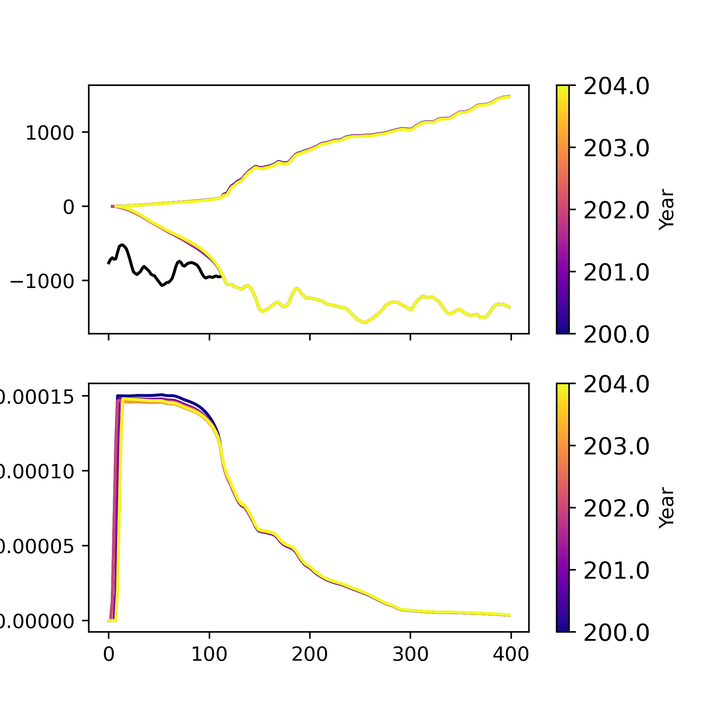
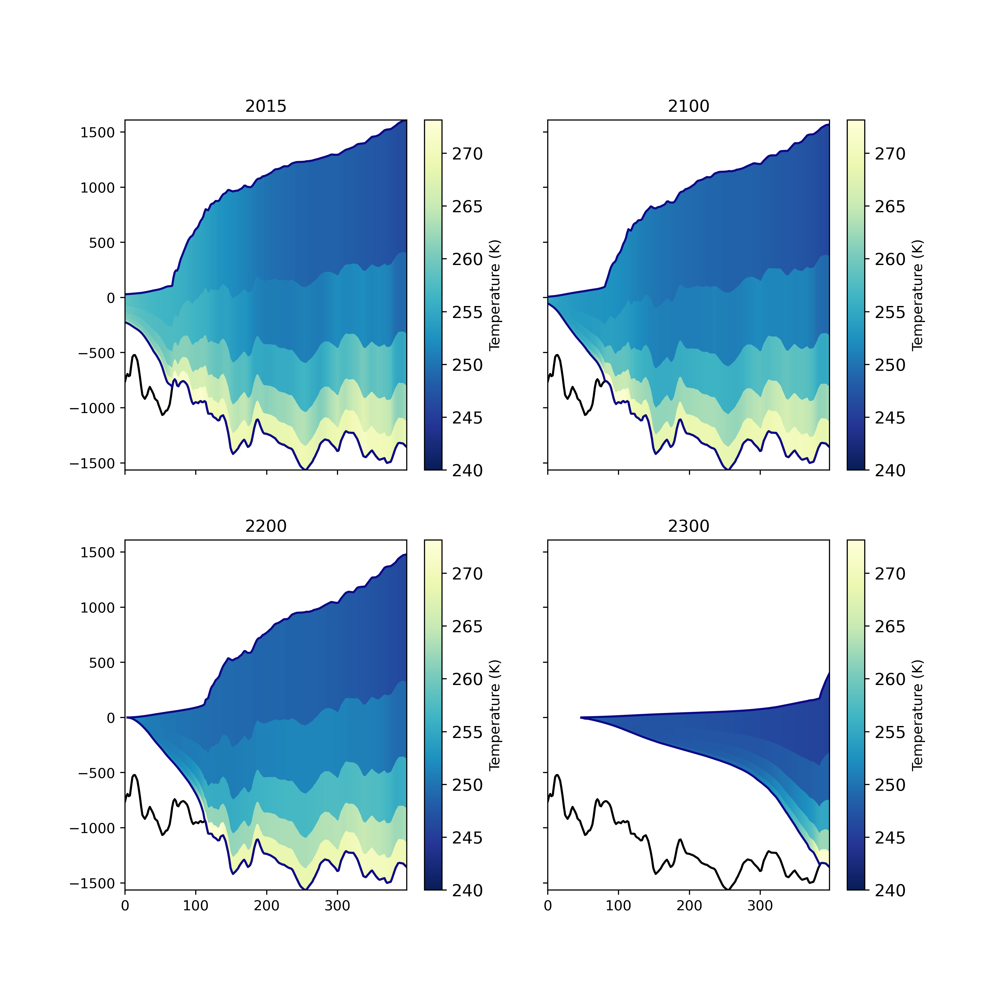
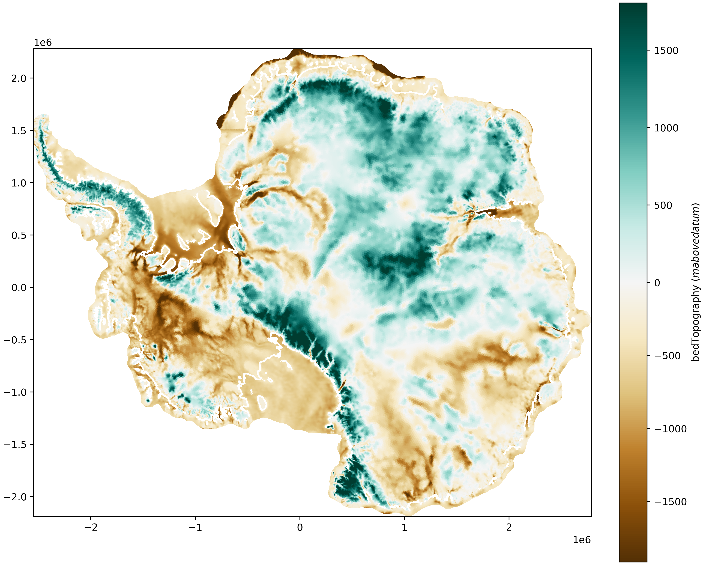
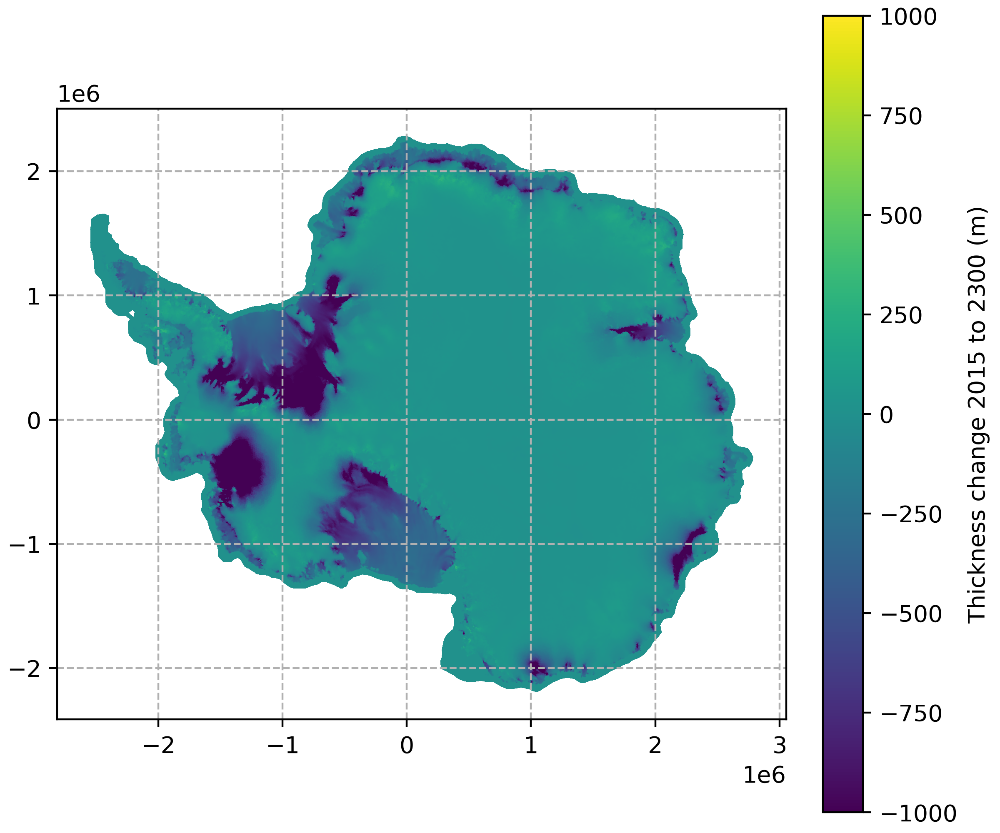
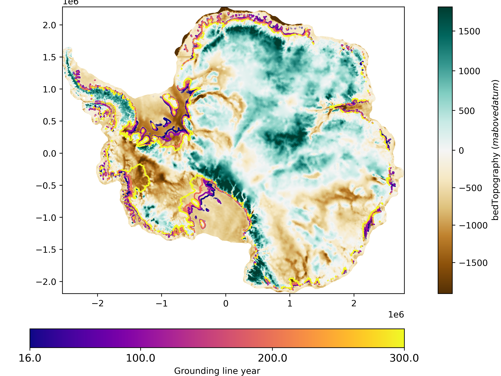

.. _landice_visualization:

*************
Visualization
*************

.. _landice_transects:

Plotting Landice Transects
==========================

The function :py:func:`mpas_tools.landice.visualization.plot_transect()` can be
used to plot transects of various cell-centered MALI variables. The above figure
was plotted with the code:

.. code-block:: python

    import matplotlib.pyplot as plt
    from netCDF4 import Dataset
    from mpas_tools.landice.visualization import plot_transect

    fig, ax = plt.subplots(2,1, figsize=(5,5), sharex=True)
    data_path = "ISMIP6/archive/expAE02/"
    file = "2200.nc"
    x = [-1589311.171,-1208886.353]
    y = [-473916.7182,-357411.6176]
    times = [0, 1, 2, 3, 4]
    plot_transect(data_path + file, "geometry", ax=ax[0], times=times,  x=x, y=y)
    plot_transect(data_path + file, "surfaceSpeed", ax=ax[1], times=times,  x=x, y=y)
    fig.savefig("thwaites_transect.png", dpi=400)

This can also be used to produce transects of ice temperature, with one
time level should be plotted per subplot:

.. code-block:: python

    fig, axs = plt.subplots(2,2, figsize=(10,10), sharex=True, sharey=True)
    files = ["rst.2015-01-01.nc", "rst.2100-01-01.nc", "rst.2200-01-01.nc", "rst.2300-01-01.nc"]
    x = [-1589311.171,-1208886.353]
    y = [-473916.7182,-357411.6176]

    for ax, file in zip(axs.ravel(), files):
        plot_transect(data_path + file, "temperature", ax=ax,
                      times=[0], x=x, y=y)
        ax.set_title(file[4:8])
    fig.savefig("thwaites_temperature_transects.png", dpi=400)

Plotting Landice Maps
=====================

The function :py:func:`mpas_tools.landice.visualization.plot_map()` can be
used to plot maps of cell-centered MALI variables. The above
figure was plotted using:

.. code-block:: python

    from mpas_tools.landice.visualization import plot_map

    fig, ax = plt.subplots(1, 1, figsize=(10,8), layout='constrained')
    var_plot, cbar, gl_plot = plot_map(data_path + files[0], "bedTopography",
                                       ax=ax, time=0, plot_grounding_line=True)

This can also be used to plot derived fields, such as thickness change from 2015 to 2300:

.. code-block:: python

    data_2300 = Dataset(data_path + "output_state_2300.nc")
    data_2300.set_auto_mask(False)
    data_2015 = Dataset(data_path + "output_state_2015.nc")
    data_2015.set_auto_mask(False)
    thk_2300 = data_2300.variables["thickness"][:]
    thk_2015 = data_2015.variables["thickness"][:]

    fig, ax = plt.subplots(1, 1, figsize=(6,5), layout='constrained')
    thk_diff_plot, thk_diff_cbar, _ = plot_map(
        data_path + "output_state_2015.nc", variable=thk_2300-thk_2015,
        ax=ax, time=0, vmin=-1000, vmax=1000, plot_grounding_line=False,
        variable_name="Thickness change 2015 to 2300 (m)")
    ax.grid(linestyle='dashed')

Plotting Landice Grounding Lines
================================

The function :py:func:`mpas_tools.landice.visualization.plot_grounding_lines()` can be
used to add grounding lines to maps as countours.

.. code-block:: python

    from mpas_tools.landice.visualization import plot_grounding_lines

    fig, ax = plt.subplots(1, 1, figsize=(8,6), layout='constrained')
    plot_grounding_lines([data_path + "output_state_2015.nc",
                          data_path + "output_state_2100.nc",
                          data_path + "output_state_2200.nc",
                          data_path + "output_state_2300.nc"],
                         ax=ax,
                         cmap="plasma", times=[0])
    plot_map(data_path + files[0], "bedTopography", ax=ax, time=0)
