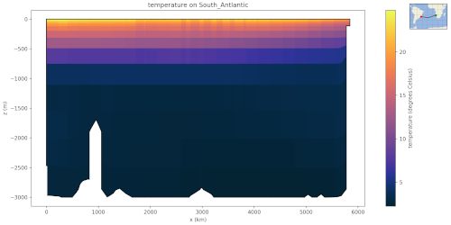

.. _ocean_visualization:

*************
Visualization
*************

.. _ocean_viz_transects:

Plotting Ocean Transects
========================

The function :py:func:`mpas_tools.ocean.viz.plot_ocean_transects()` and the
associated ``plot_ocean_transects`` command-line tool can be used to plot
transects of various MPAS-Ocean variables.  The arguments to the command-line
tool are:

.. code-block:: none

    $ plot_ocean_transects --help
    usage: plot_ocean_transects [-h] -g GEOJSON_FILENAME [-m MESH_FILENAME] -f
                                FILENAME [-v VARIABLE_LIST [VARIABLE_LIST ...]]
                                [-c COLORMAP] [--flip]

    options:
      -h, --help            show this help message and exit
      -g GEOJSON_FILENAME, --geojson GEOJSON_FILENAME
                            A geojson file with transects to plot
      -m MESH_FILENAME, --mesh MESH_FILENAME
                            An MPAS-Ocean mesh file.  If not specified, the MPAS-Ocean data file must contain the mesh.
      -f FILENAME, --file FILENAME
                            An MPAS-Ocean data file
      -v VARIABLE_LIST [VARIABLE_LIST ...], --variable_list VARIABLE_LIST [VARIABLE_LIST ...]
                            List of variables to plot.  All variables on cells in the data file is the default.
      -c COLORMAP, --colormap COLORMAP
                            A colormap to use for the plots, default depends on the field name.
      --flip                Flip the x axis for all transects

See `transects <https://github.com/MPAS-Dev/geometric_features/tree/main/geometric_data/ocean/transect>`_
from ``geometric_features`` for a examples of what a geojson transect might
look like:

.. code-block:: json

    {
        "type": "FeatureCollection",
        "features": [
            {
                "type": "Feature",
                "properties": {
                    "name": "Drake Passage",
                    "object": "transect",
                    "component": "ocean",
                    "author": "Mark Petersen, Xylar Asay-Davis, Milena Veneziani",
                },
                "geometry": {
                    "type": "LineString",
                    "coordinates": [
                        [
                            -63.02,
                            -65.46
                        ],
                        [
                            -63.81,
                            -63.8
                        ],
                        [
                            -64.42,
                            -62.02
                        ],
                        [
                            -65.04,
                            -60.25
                        ],
                        [
                            -65.74,
                            -58.28
                        ],
                        [
                            -66.37,
                            -56.39
                        ],
                        [
                            -67.02,
                            -54.44
                        ]
                    ]
                }
            }
        ]
    }

Add more features to the ``features`` list to plot multiple transects at the
same time.

The MPAS-Ocean mesh file must including not just the horizontal mesh variables
but also the vertical mesh variables (``minLevelCell``, ``maxLevelCell``,
``layerThickness``, etc.)

If you don't specify the list of variables to plot, all variables with
dimensions ``nCells`` and ``nVertLevels`` will be plotted.
