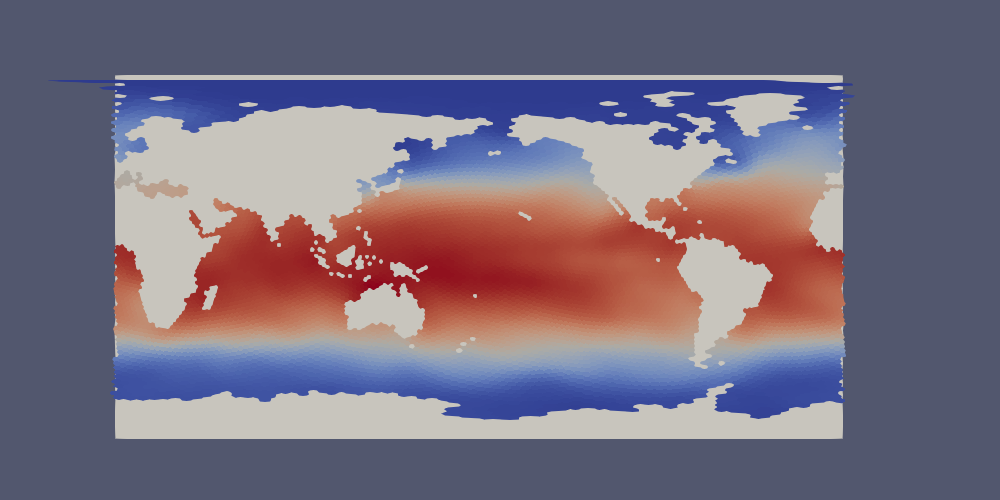
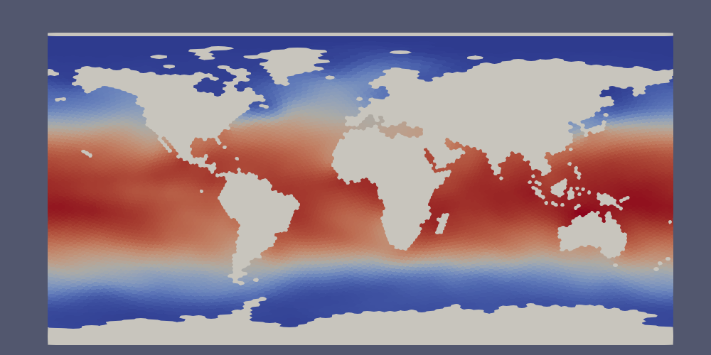
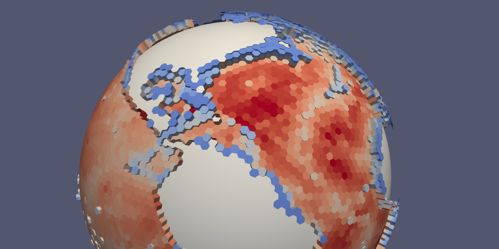
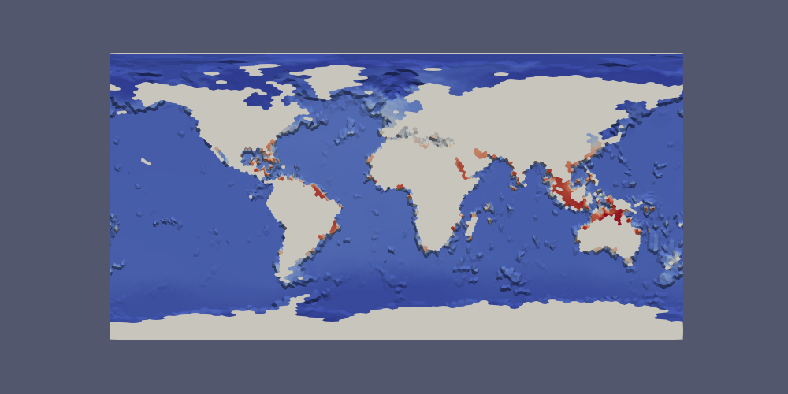
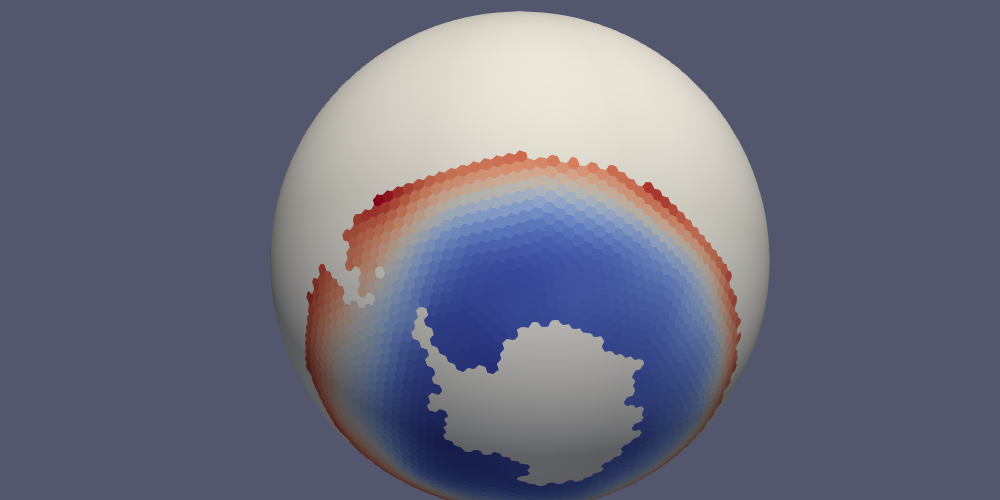

.. _paraview_extractor:

======================
ParaView VTK Extractor
======================

Data on MPAS meshes can be viewed directly in
`ParaView <https://www.paraview.org/>`_. However, those of us who work with
output from MPAS components on a regular basis have found that the built-in
capability has a number of significant limitations. These include:

* ParaView visualizes data on MPAS cell centers by connecting them to form
  triangles. The data is linearly interpolated within each triangle and
  geometry associated with the parts of MPAS cells that are adjacent to
  boundaries (e.g., land in the ocean and sea-ice components) are not visualized.
* MPAS output may not contain the mesh information needed by ParaView. This is
  typical of monthly output files, which do not include the mesh data for
  more efficient file storage.
* MPAS output files may contain significantly more data than is desired for
  visualization. The data may contain full 3D fields, whereas a few slices at
  different depths may suffice for visualization. There may also be many more
  variables in the output than are of interest. This may be a problem if the
  datasets are quite large and therefore prohibitive to transfer to another
  machine where visualization may be more practical.

For these reasons and more, we created a Python tool for extracting data on
MPAS meshes in files in `VTK <https://vtk.org/>`_ format that can be read in by
ParaView. The VTK files provide the data as "cell", rather than "point" data in
ParaView, meaning each cell has the correct polygonal geometry and will be
visualized with a single, constant value for a given field. The extractor,
which is available either through the
:py:func:`mpas_tools.viz.paraview_extractor.extract_vtk()` function or the
``paraview_vtk_field_extractor`` command-line interface, can also be used to
visualize data on MPAS vertices (visualized on triangles) and edges (visualized
on quadrilaterals).

The extractor also allows the user to select a subset of the indices along
dimensions other than ``Time``, ``nCells``, ``nVertices`` and ``nEdges``.  This
can be useful for selecting, for example, only the top layer of a 3D field.
This capability can also be used to ignore fields with a given dimension by
selecting no indices along that dimension.

By default, time-independent fields on cells are written to a file

.. code-block:: none

  vtk_files/staticFieldsOnCells.vtp

and time-dependent fields on cells are written to a series of files

.. code-block:: none

  vtk_files/timeDependentFieldsOnCells.pvd
  vtk_files/time_series/timeDependentFieldsOnCells.0.vtp
  vtk_files/time_series/timeDependentFieldsOnCells.1.vtp
  ...

and similarly for edges and vertices.  Time-independent fields can be
included in each time step of the time-dependent fields for with
``combine=True``.  This allows time-dependent and -independent fields
to be combined in filters within Paraview at the expense of considerable
additional storage space.

Since the extractor is fairly complex with a lot of possible use cases, we will
describe its functionality in several examples.

.. _extract_temperature:

Extracting a Temperature Time-series
------------------------------------

To extract fields across multiple files, passing in a regular expression
for the filename pattern, for example
``filename_pattern="hist.mpaso.timeSeriesStatsMonthly.*.nc"``. Since the mesh
data is often excluded from time series output, you may need to supply a
different file with mesh information, such as an initial condition or a restart
file: ``mesh_filename='mpaso.rst.0001-02-01_00000.nc'``.

In the following example, we extract the temperature field from a time series
of daily output from the MPAS-Ocean model:

.. code-block:: python

    from mpas_tools.viz.paraview_extractor import extract_vtk

    extract_vtk(
        filename_pattern='analysis_members/mpaso.hist.am.timeSeriesStatsDaily.*.nc',
        variable_list='timeDaily_avg_activeTracers_temperature',
        dimension_list=['nVertLevels=0'], mesh_filename='init.nc',
        out_dir='vtk_files', xtime='xtime_startDaily')

The top index (``nVertLevels=0``) is extracted from the temperature time series.
The output directory is ``'vtk_files'``.  MPAS output typically includes time
information in string format in a variable called ``xtime``.  In this instance,
we have time-averaged data and the output instead includes a start time
``xtime_startDaily`` that we need to supply instead.  (We could also supply the
end time ``xtime_endDaily`` if that were preferred for some reason.)

The result is:

.. code-block:: none

    vtk_files/fieldsOnCells.pvd
    vtk_files/time_series/fieldsOnCells.0.vtp
    ...

These files can be opened in ParaView with:

.. code-block:: none

    $ paraview vtk_files/fieldsOnCells.pvd

This will open all of the files in the ``vtk_files/time_series`` directory as
they are requested within ParaView.  See :ref:`paraview_macros` for some tips
on filling in the continents and displaying the current date in ParaView.

The same extraction could be accomplished with the command-line tool as follows:

.. code-block:: none

    $ paraview_vtk_field_extractor \
         -f "analysis_members/mpaso.hist.am.timeSeriesStatsDaily.*.nc" \
         -v timeDaily_avg_activeTracers_temperature -d nVertLevels=0 \
         -m init.nc -o vtk_files --xtime=xtime_startDaily

Extracting Multiple Fields
--------------------------

In this next example, we will extract ``areaCell`` in addition to temperature.
First, we will extract it into a separate VTK file for time-independent
variables, then we will demonstrate combining it with the time-dependent data.

In the first instance, we add ``areaCell`` to the ``variable_list`` and
explicitly include ``combine=False``, the default, to indicate that we want to
keep time-independent and time-dependent variables separate:

.. code-block:: python

    from mpas_tools.viz.paraview_extractor import extract_vtk

    extract_vtk(
        filename_pattern='analysis_members/mpaso.hist.am.timeSeriesStatsDaily.*.nc',
        variable_list=['timeDaily_avg_activeTracers_temperature', 'areaCell'],
        dimension_list=['nVertLevels=0'], mesh_filename='init.nc',
        combine=False, out_dir='vtk_files2', xtime='xtime_startDaily')

The result is:

.. code-block:: none

  vtk_files2/staticFieldsOnCells.vtp
  vtk_files2/timeDependentFieldsOnCells.pvd
  vtk_files2/time_series/timeDependentFieldsOnCells.0.vtp
    ...

We can open both ``vtk_files/staticFieldsOnCells.vtp`` and
``vtk_files/timeDependentFieldsOnCells.pvd`` in the same ParaVeiw sesson and
plot them as we like.  But we cannot perform calculations involving both
temperature and cell area very easily.  If this were a necessity, it might be
convenient to combine them into the same files:

.. code-block:: python

    from mpas_tools.viz.paraview_extractor import extract_vtk

    extract_vtk(
        filename_pattern='analysis_members/mpaso.hist.am.timeSeriesStatsDaily.*.nc',
        variable_list=['timeDaily_avg_activeTracers_temperature', 'areaCell'],
        dimension_list=['nVertLevels=0'], mesh_filename='init.nc',
        combine=True, out_dir='vtk_files3', xtime='xtime_startDaily')

Now, the result is that ``areaCell`` is included in the time-series files

.. code-block:: none

    vtk_files3/fieldsOnCells.pvd
    vtk_files3/time_series/fieldsOnCells.0.vtp
    ...

Extracting "All" Fields
-----------------------

Sometimes, you want all of the fields from your input files to be extracted.
For this purpose there is a special "variable" called ``'all'`` that gets
translated into the full list of available variables.  More often, you want to
extract all the variables on cells, edges or vertices, so there are special
"variables" for this, too: ``'allOnCells'``, ``'allOnEdges'``, and
``'allOnVertices'``.  By default, only variables from the files found by
``filename_pattern`` are expanded by these special variables.  If you also want
to include variables from the mesh file, you need to specify
``include_mesh_vars=True``.

The following example extracts all the variables on cells for both the
time-series and the mesh data.  It specifies ``maxEdges=`` so that variables
(such as ``edgesOnCell`` and ``cellsOnCell``) that include this dimension are
excluded:

.. code-block:: python

    from mpas_tools.viz.paraview_extractor import extract_vtk

    extract_vtk(
        filename_pattern='analysis_members/mpaso.hist.am.timeSeriesStatsDaily.*.nc',
        variable_list=['allOnCells'],
        dimension_list=['nVertLevels=0', 'nVertLevelsP1=0', 'maxEdges='],
        mesh_filename='init.nc', combine=True, include_mesh_vars=True,
        out_dir='vtk_files4', xtime='xtime_startDaily')

Indexing Dimensions
-------------------

In the previous examples, we saw a basic example of indexing the "extra"
dimensions (i.e. dimensions other than ``Time``, ``nCells``, ``nVertices`` and
``nEdges``) from MPAS output.  Here, we show some slightly more involved
examples.

Indices for extra dimensions can either be supplied at runtime at a prompt (if
``dimension_list=None``) or via a list of strings with the dimensions and
associated indices.  For each extra dimension, you can specify nothing for the
indices (an empty string, meaning skip any fields with this dimension), a single
index, a comma-separated list of indices, or a range of indices (separated by 1
or 2 colons).  For example,

.. code-block:: python

    dimension_list=['maxEdges=', 'nVertLeves=0:10:2', 'nParticles=0,2,4,6,8']

will ignore any fields with dimension ``maxEdges``, extract every other
layer from the first 10 vertical levels (each into its own field) and
extract the 5 specified particles.

An index array can also be specified in this way (and these can be mixed
with integer indices in a comma-separated list but not in a colon-separated
range):

.. code-block:: python

    dimension_list=['nVertLeves=0,maxLevelCell']

This will extract fields from the first vertical level and the vertical level
with index given by ``maxLevelCell`` (the deepest layer in each ocean column).

Here is a more complete example that extracts the temperature, salinity and
layer thickness at the sea surface and seafloor.

.. code-block:: python

    from mpas_tools.viz.paraview_extractor import extract_vtk

    extract_vtk(
        filename_pattern='analysis_members/mpaso.hist.am.timeSeriesStatsDaily.*.nc',
        variable_list=['timeDaily_avg_activeTracers_temperature',
                       'timeDaily_avg_activeTracers_salinity',
                       'timeDaily_avg_layerThickness'],
        dimension_list=['nVertLevels=0,maxLevelCell'], mesh_filename='init.nc',
        out_dir='vtk_files5', xtime='xtime_startDaily')

The resulting fields are named:

.. code-block:: none

    timeDaily_avg_activeTracers_temperature_0
    timeDaily_avg_activeTracers_temperature_maxLevelCell
    timeDaily_avg_activeTracers_salinity_0
    timeDaily_avg_activeTracers_salinity_maxLevelCell
    timeDaily_avg_layerThickness_0
    timeDaily_avg_layerThickness_maxLevelCell

Indexing Time
-------------

Time can also be indexed like the other dimensions, but it is not passed to the
``dimension_list`` argument but instead to the ``time`` argument.  The time
index string can have any of the following formats:

* ``''`` - no times are to be extracted (probably not useful for ``time``)
* ``'n'`` - the index n is to be extracted
* ``'m,n,p'`` - the list of indices is to be extracted
* ``'m:n'`` - all indices from m to n are to be extracted (including m but
  excluding n, in the typical python indexing convention)
* ``'m:n:s'`` - all indices from m to n are to be extracted (including m but
  excluding n, in the typical python indexing convention) with stride s between
  indices

In this example, we extract every 6 days from the daily data set starting with
the beginning fo the data set and continuing to the end (by not specifying the
end index ``n``):

.. code-block:: python

    from mpas_tools.viz.paraview_extractor import extract_vtk

    extract_vtk(
        filename_pattern='analysis_members/mpaso.hist.am.timeSeriesStatsDaily.*.nc',
        variable_list=['timeDaily_avg_activeTracers_temperature'],
        dimension_list=['nVertLevels=0'], mesh_filename='init.nc',
        time='0::6', out_dir='vtk_files6', xtime='xtime_startDaily')

Ignoring Time
-------------

Some MPAS files, for example mesh files and initial conditions, contain a
``Time`` dimension but no ``xtime`` variable.  The extractor will complain about
this unless you specify ``ignore_time=True``.  In this case, only the first time
index is used and all fields are considered to be time-independent, ending
up in ``staticFieldsOnCells.vtp``, etc.

Lon/Lat Coordinates
-------------------

The extractor can produce files in lon/lat coordinates instead of 3D Cartesian
space if ``lonlat=True``.  Polygons near the prime meridian (0 or 360 degrees
longitude) will end up on one side or the other based on the location of the
cell center.  This leads to a "ragged" edge a the prime meridian, particularly
for coarse-resolution meshes:

Below, we will provide a method for handling this issue in ParaView.

Here, we extract the temperature field as in :ref:`extract_temperature`, but
this time in lon/lat coordinates.

.. code-block:: python

    from mpas_tools.viz.paraview_extractor import extract_vtk

    extract_vtk(
        filename_pattern='analysis_members/mpaso.hist.am.timeSeriesStatsDaily.*.nc',
        variable_list='timeDaily_avg_activeTracers_temperature',
        dimension_list=['nVertLevels=0'], mesh_filename='init.nc',
        lonlat=True, out_dir='vtk_files7', xtime='xtime_startDaily')

In ParaView, the data lies approximately 0 and 360 degrees long the x axis but
with some polygons extending partially beyond these bounds.  Since we typically
wish to see the data between -180 and 180 degrees longitude, the proposed fix
will take care of both the longitude range and the ragged edges in one go.

First, we make a duplicate copy of the data, translated by -360 degrees. Open
a Transform Filter in ParaView and enter ``-360`` in the first Translate cell
(the x axis).  Uncheck "Show Box" and hit "Apply".  The original data will
disappear but you can simply click the eye icon next to it to make it reappear.

Next, we want to combine the original and translated versions of the mesh into
a single dataset.  Use the shift key to select both, then open the Group
Datasets Filter, then hit "Apply".

Finally, we will crop the grouped dataset to the range of -180 to 180 degrees:

* Select the final of the three "GroupDataset1" items,
* open a Clip Filter,
* select "Plane" as the Clip Type,
* set the Origin to -180, 0, 0,
* set the Normal to -1, 0, 0

This has clipped the extra data off the left edge.  Now for the right edge:

* Select the "Clip1" item,
* open a Clip Filter again,
* select "Plane" as the Clip Type,
* set the Origin to 180, 0, 0,
* set the Normal to 1, 0, 0,
* uncheck "Show Plane"

Now, the data should have clean edges.  If you want, you can put a plane behind
it to fill in the land:

Topographic Data
----------------

The extractor includes optional support for extracting geometry appropriate
for displaying variables at the depth of a topographic feature (typically
the top or bottom of the domain) for MPAS components with a spatially
variable top or bottom index (e.g. ``maxLevelCell`` in MPAS-Ocean).  This is
accomplished with arguments such as:

.. code-block:: python

    topo_dim='nVertLevels', topo_cell_index='maxLevelCell'

Fields on cells are sampled at the topographic index and the geometry
includes polygons corresponding to edges so that vertical faces between
adjacent cells can be displayed.  Fields are extracted as normal except
that they are sampled as point data rather than cell data, allowing
computations in ParaView to display the topography.  A mask field is also
included, indicating which parts of edge polygons correspond to the boundary
of the domain (``boundaryMask == 1``) and which parts of cell and edge
polygons are interior (``boundaryMask == 0``).

In the following, we make sure to use ``combine=True`` and
``include_mesh_vars=True`` because we need ``bottomDepth`` from the mesh file
to be included in the time-dependent output files.  We are not interested in
variables with dimensions ``nVertLevelsP1`` or ``maxEdges`` so we remove those
dimensions by leaving their index strings blank.

.. code-block:: python

    from mpas_tools.viz.paraview_extractor import extract_vtk

    extract_vtk(
        filename_pattern='analysis_members/mpaso.hist.am.timeSeriesStatsDaily.*.nc',
        variable_list='allOnCells',
        dimension_list=['nVertLevelsP1=', 'maxEdges='],
        topo_dim='nVertLevels', topo_cell_index='maxLevelCell',
        combine=True, include_mesh_vars=True, mesh_filename='init.nc',
        out_dir='vtk_files8', xtime='xtime_startDaily')

Together, this can be used to plot topography by using a Calculator Filter in
ParaView, checking the "Coordinate Result" box, and entering the following:

.. code-block:: none

  coords*(1.0 + 100.0/mag(coords)*((1 - boundaryMask)*(-bottomDepth)
                                   + 10.0*boundaryMask))

The result is that the MPAS-Ocean topography is displayed with a vertical
exaggeration of 100 and with a value equivalent to 10 m along boundary points of
edge polygons (a "water-tight" surface).

Here is what that looks like for a 240-km (very coarse) ocean mesh:

The same approach can be used with ``lonlat=True``.  In this case, the
Calculator Filter is a bit simpler:

.. code-block:: none

  coords + 1e-3*(1 - boundaryMask)*(-bottomDepth)*kHat + 1.0*boundaryMask*kHat

Here is the bottom temperature in such a plot:

Extracting a Region
-------------------

Some simulations are focused on a small region, even though the entire globe is
included in the mesh.  For such situations, we provide a way to extract a
subset of the data over a region before converting it to VTK format.  The user
specifies a
`FeatureCollection <http://mpas-dev.github.io/geometric_features/stable/feature_collection.html>`_
from the ``geometric_features`` package as an argument.  The regions in this
feature collection are used to define a mask, and the MPAS data is culled to
lie within the mask before conversion to VTK proceeds.

.. note::

    The region should indicate the parts of the mesh to keep, not those to
    remove.

In this example, we extract sea surface temperature only in the Southern Ocean:

.. code-block:: python

    from mpas_tools.viz.paraview_extractor import extract_vtk
    from geometric_features import GeometricFeatures

    gf = GeometricFeatures()
    fc = gf.read(componentName='ocean', objectType='region',
                 featureNames=['Southern Ocean'])

    extract_vtk(
        filename_pattern='analysis_members/mpaso.hist.am.timeSeriesStatsDaily.*.nc',
        variable_list='timeDaily_avg_activeTracers_temperature',
        dimension_list=['nVertLevels=0'], mesh_filename='init.nc',
        fc_region_mask=fc, out_dir='vtk_files9', xtime='xtime_startDaily')

.. _paraview_macros:

ParaView Macros
---------------

We also provide two macros that can be imported into ParaView,
`add_earth_sphere.py <https://github.com/MPAS-Dev/MPAS-Tools/blob/master/visualization/paraview_vtk_field_extractor/add_earth_sphere.py>`_
and
`annotate_date.py <https://github.com/MPAS-Dev/MPAS-Tools/blob/master/visualization/paraview_vtk_field_extractor/annotate_date.py>`_.
Download them and then go to Macros > Add New Macro, and select each file.

The first of these adds a sphere that is just a bit smaller than the MPAS data
on the sphere so that continents are not holes in the data.  The second can
be used to display the current time (extracted from the ``xtime`` variable) in
a ParaVeiw animation.
