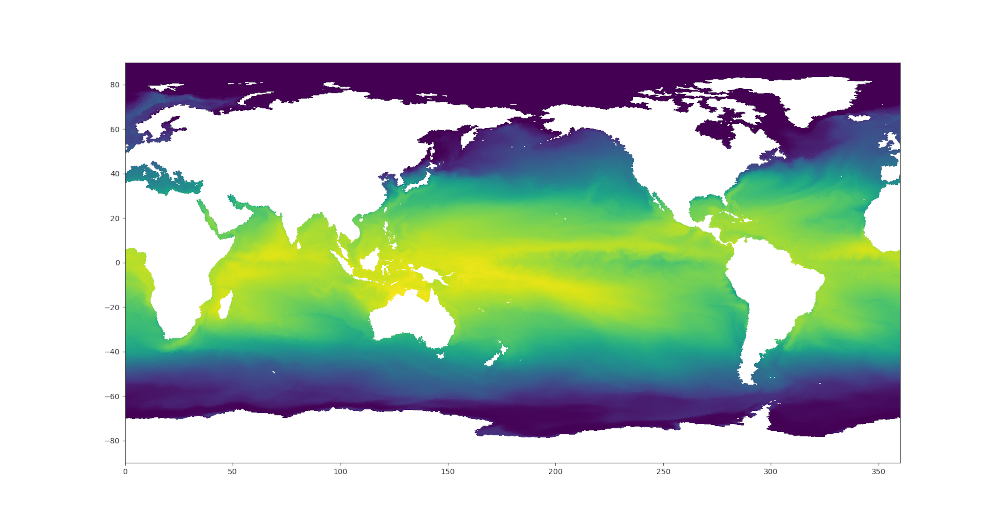

.. _visualization:

*************
Visualization
*************

MPAS-Tools has kind of a hodge-podge of unrelated visualization tools.  This is
largely because MPAS-Tools is conceived of primarily as a repository for tools
for manipulating MPAS meshes during their construction and initialization.

.. _viz_mpas_to_xdmf:

MPAS to XDMF Converter
======================

The MPAS to XDMF Converter offers a cutting-edge solution for converting MPAS
data into a ParaView-friendly format. It is not only significantly faster but
also more efficient in terms of disk usage, making it a better alternative to
the VTK extractor.

Please refer to :doc:`mpas_to_xdmf` for detailed information.

.. _viz_paraview_extractor:

ParaView VTK Extractor
======================

Documentation for the ParaView VTK Extractor has been moved to its own page.
Please refer to :doc:`paraview_extractor` for detailed information.

.. _viz_mesh_tris:

MPAS Mesh to Triangles
======================

A relatively new and under-explored functionality in MPAS-Tools is the
capability to extract a triangle mesh for visualization from an MPAS mesh.
This functionality comes from the function
:py:func:`mpas_tools.viz.mesh_to_triangles.mesh_to_triangles()`. The function
takes an MPAS mesh as an ``xarray.Dataset`` object as its only required input
and produces another ``xarray.Dataset`` with the triangle mesh that connects
pairs of adjacent vertices to cell centers as its output.  Thus, each hexagon
becomes 6 triangles, each pentagon becomes 5, and so on.

In addition to the points and connectivity data for defining these trinagles,
the output dataset, ``dsTris``, also includes the cell index that each triangle
is in and cell indices and weights for interpolating data defined at cell
centers to triangle nodes.  ``dsTris`` includes variables ``triCellIndices``,
the cell that each triangle is part of; ``nodeCellIndices`` and
``nodeCellWeights``, the indices and weights used to interpolate from MPAS cell
centers to triangle nodes; Cartesian coordinates ``xNode``, ``yNode``, and
``zNode``; and ``lonNode``` and ``latNode`` in radians. ``lonNode`` is
guaranteed to be within 180 degrees of the cell center corresponding to
``triCellIndices``.  Nodes always have a counterclockwise winding.

Here is an example workflow for using this function:

.. code-block:: python

    import xarray
    import numpy
    import matplotlib.pyplot as plt
    from matplotlib.tri import Triangulation

    from mpas_tools.viz import mesh_to_triangles


    dsMesh = xarray.open_dataset('mpaso.rst.0501-01-01_00000.nc')
    dsTris = mesh_to_triangles(dsMesh, periodicCopy=True)

    sst = dsMesh.temperature.isel(Time=0, nVertLevels=0).values

    sstTri = sst[dsTris.triCellIndices]

    sstNode = (sst[dsTris.nodeCellIndices]*dsTris.nodeCellWeights).sum('nInterp')

    nTriangles = dsTris.sizes['nTriangles']
    tris = numpy.arange(3*nTriangles).reshape(nTriangles, 3)

    lonNode = numpy.rad2deg(dsTris.lonNode.values).ravel()
    latNode = numpy.rad2deg(dsTris.latNode.values).ravel()
    sstNode = sstNode.values.ravel()

    triangles = Triangulation(lonNode, latNode, tris)

    plt.figure(1)
    plt.tripcolor(triangles, sstNode, shading='gouraud')
    plt.xlim([0., 360.])
    plt.ylim([-90., 90.])

    plt.figure(2)
    plt.tripcolor(triangles, sstTri, shading='flat')
    plt.xlim([0., 360.])
    plt.ylim([-90., 90.])

    plt.show()

In this example, ``mpaso.rst.0501-01-01_00000.nc`` is a restart file from a
simulation with an EC at the default 30 to 60 km resolution (see
:ref:`ec_mesh`); the restart file contains both mesh information and a snapshot
of the 3D temperature field.

Here are the resulting plots (which look nearly identical at this resolution):

.. image:: images/ec60to30_tris_gouraud.png
   :width: 500 px
   :align: center



.. _viz_colormaps:

Colormaps
=========

Some MPAS-Tools routines include plots of mesh resolution and related variables.
We have found it handy to use the
`SciVisColor Colormaps <https://sciviscolor.org/>`_ for some of these plots.
Unfortunately, there is not a standard python package for adding these
colormaps to ``matplotlib`` (as is the case for
`cmocean <https://matplotlib.org/cmocean/>`_, for example).  To add the
SciVisColor colormaps, call the function
:py:func:`mpas_tools.viz.colormaps.register_sci_viz_colormaps()`.  No arguments
are required, as the XML files for defining the colormaps are included in the
package.

In this example, we use the ``3Wbgy5`` colormap:

.. image:: images/so60to12_res.png
   :width: 500 px
   :align: center
